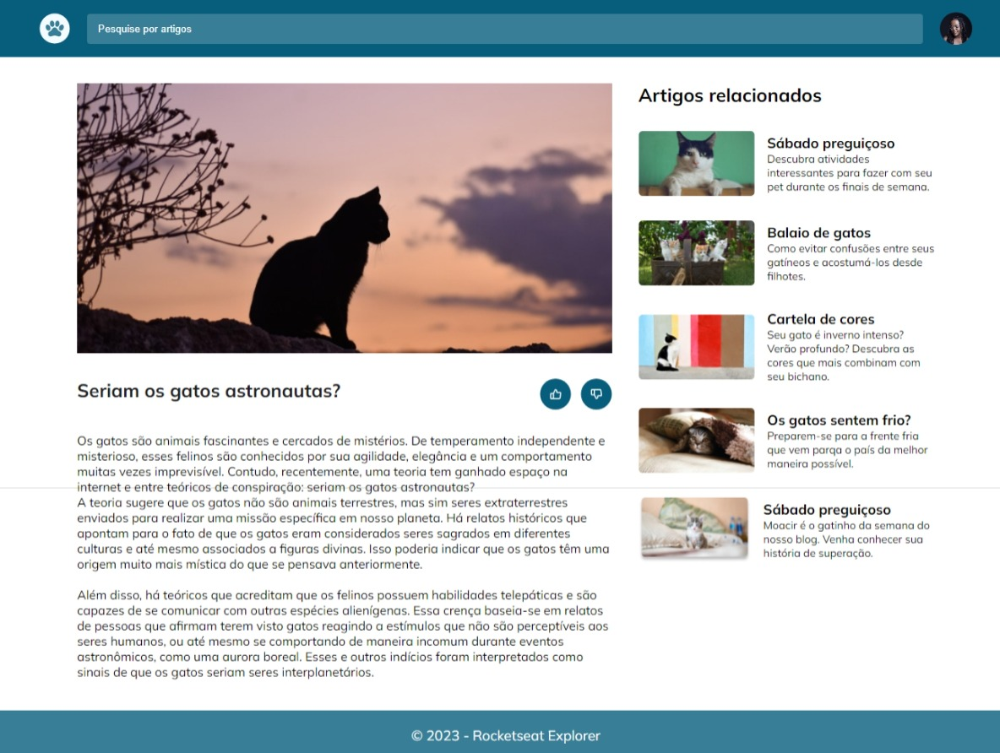
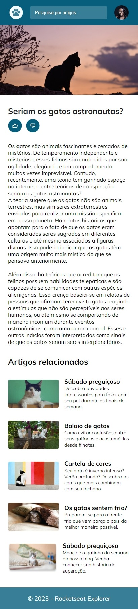

<h1 align="center" style="color: #0f4a6e">Desafio 02: Blog de gatos
</h1>

Explorer Stag 3

  <a href="#tecnologias" style="color: #156a9d">Tecnologias</a>&nbsp;&nbsp;&nbsp;|&nbsp;&nbsp;&nbsp;
  <a href="#aprendizado" style="color: #156a9d">Principais aprendizados</a>&nbsp;&nbsp;&nbsp;|&nbsp;&nbsp;&nbsp;
  <a href="#projeto" style="color: #156a9d">Projeto</a>&nbsp;&nbsp;&nbsp;|&nbsp;&nbsp;&nbsp;
  <a href="#como-executar" style="color: #156a9d">Como executar</a>&nbsp;&nbsp;&nbsp;|&nbsp;&nbsp;&nbsp;
  <a href="#licença" style="color: #156a9d">Licença</a>

 

<h3 style="color: #0f4a6e">Desktop</h3>

  

<h3 style="color: #0f4a6e">Mobile</h3>

  

<h2 id="tecnologias" style="color: #4a4e69">🚀 Tecnologias</h2>

Esse projeto foi desenvolvido com as seguintes tecnologias:

- HTML e CSS

<h2 id="aprendizado" style="color: #4a4e69"> 📃 Principais aprendizados:</h2>

- Implementação de design responsivo para garantir uma boa experiência de usuário em diferentes tamanhos de tela.
- Utilização do display grid para criar layouts flexíveis e dinâmicos.
- Aplicação de boas práticas de HTML e CSS para uma estrutura de código limpa e organizada.

<h2 id="projeto" style="color: #4a4e69">💻 Projeto</h2>

O "Blog de Gatos" é uma página web que apresenta diversos artigos e conteúdos sobre gatos. Através de uma interface simples e elegante, os usuários podem explorar artigos relacionados a cuidados, curiosidades e histórias fascinantes sobre gatos.

<h2 id="como-executar" style="color: #4a4e69">🔖 Como executar</h2>

Clone o repositório para o seu ambiente local.

Abra o arquivo index.html no seu navegador preferido.

<h2 id="licença" style="color: #4a4e69">  📝Licença</h2>

Esse projeto está sob a licença MIT.